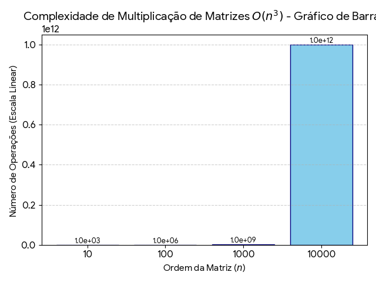
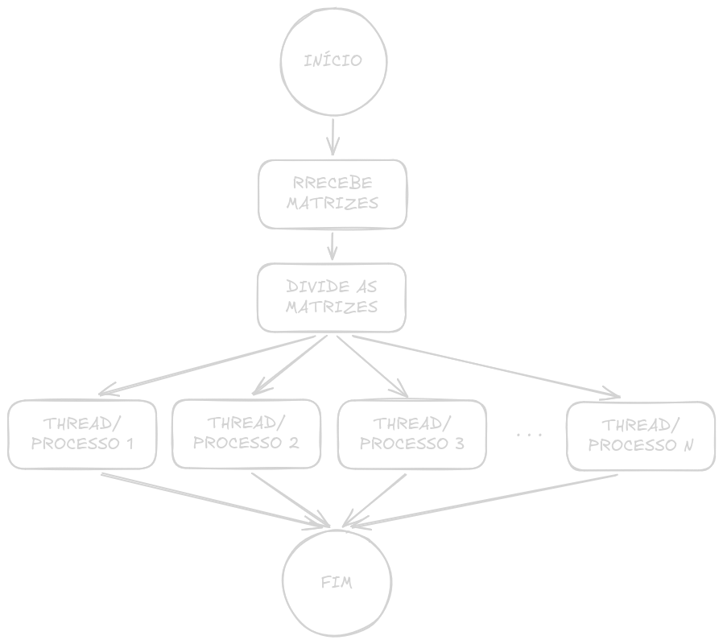

+++
title = "Como usar 100% da CPU com matrizes"
date = 2026-04-16T16:50:58-05:00
draft = false
author = "Pedrinho"
tags = ["matrizes", "paralelismo", "threads", "process"]
+++

> IMPORTANTE: Este posto foi escrito por um estudante que ainda está aprendendo, então pode conter erros conceituais. Cheque as informações com livros e, caso encontre algum erro pode entrar em contato comigo para que eu corrija.
# Entendendo o problema
Nas nossas primeiras aulas de programação, sempre é dito a nós que o código é executado de cima pra baixo e da esquerda pra direita; o que é verdade, porém depende.

Na vida real, quando se usa um código que executa sequencialmente, temos um longo processo tomando tempo de processamento na CPU e devido ao gerenciamento (em termos técnicos "Escalonamento"), esse processo vai ser retirado e reinserido na execução, algo que é chamado de preempção.

Bom, depois de largar essas informações, vamos começar a tratar do objetivo deste post, onde eu vou abordar a cerca de um trabalho que realizei na primeira unidade da disciplina de Sistemas Operacionais na UFRN.

Basicamente, o nosso problema é a multiplicação de matrizes, cálculo bem conhecido, especialmente por aqueles na área de inteligência artificial.

## Mas o que tem de mais com a multiplicação de matrizes?

Vamos começar olhando o código:

```cpp
for(int i = 0; i < n1; i++){
    for(int j = 0; j < m2; j++){
        matrizC[i][j] = 0;
        for(int k = 0; k < m1; k++) {
            matrizC[i][j] += matrizA[i][k] * matrizB[k][j];
        }
    }
}
```

Veja que pra multiplicação de matrizes, usamos 3 laços `for()` para calcular cada elemento, algo que quando trabalhamos com poucos elementos, como por exemplo uma matriz de ordem 100, leva pouquíssimo tempo; considerando a nossa noção de tempo, podemos até dizer que é instantâneo.

>Agora, imagine a multiplicação de uma matriz de ordem 1000, ou 10000, ou 100000

Adicionando um pouco de matemática (pra quem é desses), a complexidade da operação de multiplicação de uma matriz pode ser representada pela fórmula:

$$
C(n) = n^3
$$

Visualizando de uma forma mais gráfica, temos:

<div style="text-align: center;">
  
</div>

Onde $n$ é a ordem da matriz, ou seja, seu tamanho. Também dá pra calcular o tempo que levaria pra calcular isso com matemática, mas eu ainda não cheguei lá, por isso, vamos de C++.

---

## Como lidar com matrizes grandes?

No caso de matrizes grandes, é possível paralelizar o trabalho, ou seja, dividir o trabalho para que ele possa ser processado simultaneamente.

Trocando em miúdos...

> Se um pedreiro constrói uma casa em 12 meses, 12 pedreiros constroem uma em 1 mês?

De forma simplória, podemos dizer que sim, mas na prática sabemos que não é bem assim. Claro que 12 pedreiros vão construir uma casa mais rápido, porém há um limite: nem toda tarefa pode ser dividida.

> 9 grávidas não têm um bebê em um mês

No caso desta segunda frase, estamos lidando com um problema essencialmente indivisível. Já no exemplo dos pedreiros, podemos dividir a atividade.

> Quanto mais pedreiros, menos tempo?

Depende. Outros fatores entram na conta:

- Você vai conseguir suprir materiais para todos?
- Eles terão espaço suficiente para trabalhar? *(considere o pedreiro como um cilindro)*

Além disso, algumas atividades dependem de outras já concluídas.

---

## Cálculo sequencial

Antes de seguirmos com o paralelismo, vamos fazer a multiplicação de matrizes de forma sequencial para termos uma base.
O nosso padrão será duas matrizes quadradas de ordem 3200, preenchidas com valores aleatórios de 0 até 1000.
Se você estiver implementando este código, use a biblioteca `vector` para alocar os arrays bidimensionais (matriz), porque o método tradicional `int matrizA[i][j]` não escala bem.

<div>
$$
\begin{bmatrix}
a_{1,1} & \dots & a_{1,3200} \\
\vdots & \ddots & \vdots \\
a_{3200,1} & \dots & a_{3200,3200}
\end{bmatrix}
\times
\begin{bmatrix}
b_{1,1} & \dots & b_{1,3200} \\
\vdots & \ddots & \vdots \\
b_{3200,1} & \dots & b_{3200,3200}
\end{bmatrix}
=
\begin{bmatrix}
c_{1,1} & \dots & c_{1,3200} \\
\vdots & \ddots & \vdots \\
c_{3200,1} & \dots & c_{3200,3200}
\end{bmatrix}
$$
</div>

A pouco eu mostrei o código que realiza essa multiplicação. Vamos usar 10 iterações para obter um tempo médio.

Fazendo isso, obtivemos:

- Tempo total: **123.367100 s**
- Aproximadamente: **2 min e 3 s**

Com isso, podemos seguir para a paralelização.

---

## Processos e Threads

Neste post, vou mostrar o uso de processos e threads para paralelizar o processamento.

A ideia é simples: dividir a matriz e atribuir partes para cada unidade de execução.vai receber a sua fatia pra calcular o resultado, assim como pode ser visto no fluxograma abaixo:
<div style="text-align: center;">
  
</div>
No código que estou utilizando, cada entidade tem seu próprio arquivo de saída, onde ele armazena o elemento e seu resultado, além do tempo decorrido na thread/processo.

Assim como no cálculo sequencial, vou realizar 10 iterações em cada abordagem, e cada bateria de 10 iterações vai ser executada com diferentes quantidades de unidades de execução; mais especificamente 2, 4, 8 e 16 threads/processos.

O tempo a ser considerado será o pior tempo entre cada unidade na execução, sendo ele calculado pela própria função de multiplicação de matriz a partir do uso da biblioteca `chronos`.
### Processos

> IMPORTANTE: Nesta implementação de processos é necessário usar Linux ou mac. Caso esteja usando windows, você pode mudar a implementação coma a biblioteca específica do windows ou usar o WSL.

Basicamente, um processo é uma instância de um programa, ou o programa em sí; cada processo tem seu contexto de software e de hardware e tudo isso é uma atividade ativa que consome processamento do CPU.
Cada processo tem seu próprio registrador, contador de programa, espaço de endereçamento e  o gerenciamento de estado (feito pelo escalonador).

Para criar os processos, utilizamos a função `fork()`que origina processos filhos a partir de um processo pai. Cada processo pode ser identificado com seu PID (Process Identification), e usando ele podemos distinguir o pai de seus filhos, e a partir disso atribuímos o código a ser utilizado pelos filhos.

Também enviamos aos filhos qual parte da matriz eles irão ser responsáveis por calcular, ao invés das dimensões completas.

No nosso código, a implementação ficou assim:

```cpp
// Fatiando a matriz
divProcessos = n1 / numProcessos;

// Loop for para criar os processos
for (int p = 0; p < numProcessos; p++) {
    pid_t pid = fork();

      if (pid < 0) {
        perror("Falha no fork");
        return 1;
        }

    // Passa o código para os processos filhos
    if (pid == 0) {
        int inicio = p * divProcessos;
        int fim = (p == numProcessos - 1) ? n1 : (p + 1) * divProcessos;

        // Cria arquivo de saída e chama a função de multiplicação
        std::string nomeArq = "resultadoProcess"+ 
					        std::to_string(m1) 
					        +"_P" + std::to_string(numProcessos) 
					        + "_it" + std::to_string(it+1)
                            + "_p" + std::to_string(p) + ".txt";

        multiplicaMatriz(inicio, fim, matrizA, matrizB, matrizC, m1, m2, nomeArq);

        exit(0);
        }
    }

// O pai espera os filhos terminarem
for (int p = 0; p < numProcessos; p++) {
    wait(nullptr);
}
```

Nas rodadas de teste obtivemos os seguintes tempos médios:

<center>

<style type="text/css">
.tg  {border-collapse:collapse;border-spacing:0;}
.tg td{border-color:black;border-style:solid;border-width:1px;font-family:Arial, sans-serif;font-size:14px;
  overflow:hidden;padding:10px 5px;word-break:normal;}
.tg th{border-color:black;border-style:solid;border-width:1px;font-family:Arial, sans-serif;font-size:14px;
  font-weight:normal;overflow:hidden;padding:10px 5px;word-break:normal;}
.tg .tg-c3ow{border-color:inherit;text-align:center;vertical-align:top}
.tg .tg-0pky{border-color:inherit;text-align:left;vertical-align:top}
</style>
<table class="tg"><thead>
  <tr>
    <th class="tg-c3ow">Nº de processos</th>
    <th class="tg-c3ow">Tempo médio (s)</th>
  </tr></thead>
<tbody>
  <tr>
    <td class="tg-0pky">2</td>
    <td class="tg-0pky">73.978550</td>
  </tr>
  <tr>
    <td class="tg-0pky">4</td>
    <td class="tg-0pky">42.505980</td>
  </tr>
  <tr>
    <td class="tg-0pky">8</td>
    <td class="tg-0pky">43.686920</td>
  </tr>
  <tr>
    <td class="tg-0pky">16</td>
    <td class="tg-0pky">44.660060</td>
  </tr>
</tbody>
</table>
</center>

Já se nota uma queda considerável no tempo de processamento, mais adiante vamos discutir estes resultados com mais detalhes.
### Threads
As threads são os fluxos de execução de um programa, um exemplo muito comum aos estudantes de computação é o uso de threads para gerenciar conexões em um programa servidor.

Assim, um programa costuma ter múltiplas threads executando diferentes atividades, e devido a sua característica de compartilhar o espaço de endereçamento, elas costumam ser mais leves que programas.

Também podem ser mais simples  de implementar

