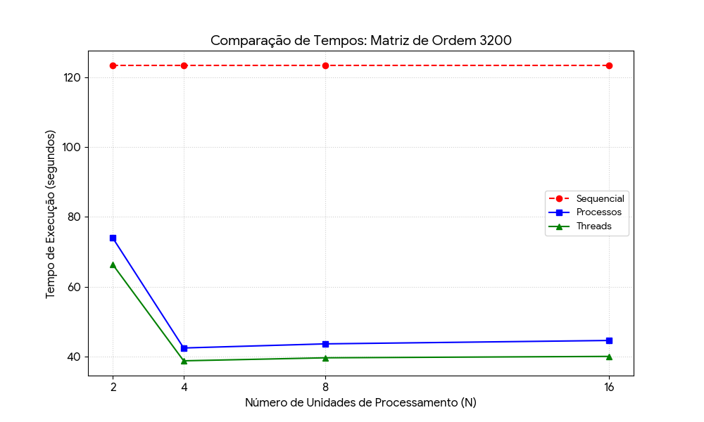
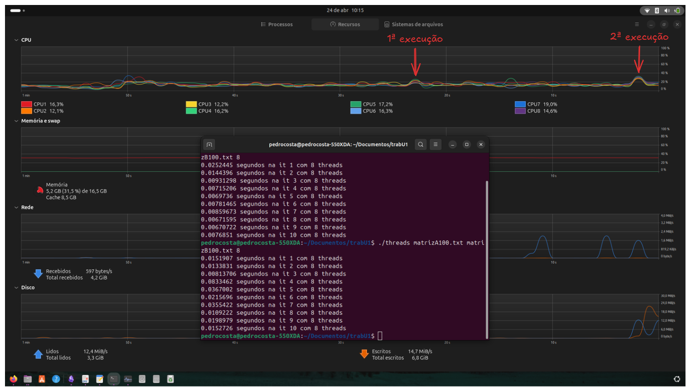

+++
title = "Como usar 100% da CPU com matrizes"
date = 2026-04-16T16:50:58-05:00
draft = false
author = "Pedrinho"
tags = ["matrizes", "paralelismo", "threads", "process"]
+++

> IMPORTANTE: Este post foi escrito por um estudante que ainda está aprendendo, então pode conter erros conceituais. Cheque as informações com livros e, caso encontre algum erro pode entrar em contato comigo para que eu corrija.
# Entendendo o problema
Nas nossas primeiras aulas de programação, sempre é dito a nós que o código é executado de cima pra baixo e da esquerda pra direita; o que é verdade, porém depende.

Na vida real, quando se usa um código que executa sequencialmente, temos um longo processo tomando tempo de processamento na CPU e devido ao gerenciamento (em termos técnicos "Escalonamento"), esse processo vai ser retirado e reinserido na execução, algo que é chamado de preempção.

Bom, depois de largar essas informações, vamos começar a tratar do objetivo deste post, onde eu vou abordar a cerca de um trabalho que realizei na primeira unidade da disciplina de Sistemas Operacionais na UFRN.

Basicamente, o nosso problema é a multiplicação de matrizes, cálculo bem conhecido, especialmente por aqueles na área de inteligência artificial.

## Mas o que tem de mais com a multiplicação de matrizes?

Vamos começar olhando o código:

```cpp
for(int i = 0; i < n1; i++){
    for(int j = 0; j < m2; j++){
        matrizC[i][j] = 0;
        for(int k = 0; k < m1; k++) {
            matrizC[i][j] += matrizA[i][k] * matrizB[k][j];
        }
    }
}
```

Veja que pra multiplicação de matrizes, usamos 3 laços `for()` para calcular cada elemento, algo que quando trabalhamos com poucos elementos, como por exemplo uma matriz de ordem 100, leva pouquíssimo tempo; considerando a nossa noção de tempo, podemos até dizer que é instantâneo.

>Agora, imagine a multiplicação de uma matriz de ordem 1000, ou 10000, ou 100000

Adicionando um pouco de matemática (pra quem é desses), a complexidade da operação de multiplicação de uma matriz pode ser representada pela fórmula:

$$
C(n) = n^3
$$

Visualizando de uma forma mais gráfica, temos:

<div style="text-align: center;">
  
</div>

Onde $n$ é a ordem da matriz, ou seja, seu tamanho. Também dá pra calcular o tempo que levaria pra calcular isso com matemática, mas eu ainda não cheguei lá, por isso, vamos de C++.

---

## Como lidar com matrizes grandes?

No caso de matrizes grandes, é possível paralelizar o trabalho, ou seja, dividir o trabalho para que ele possa ser processado simultaneamente.

Trocando em miúdos...

> Se um pedreiro constrói uma casa em 12 meses, 12 pedreiros constroem uma em 1 mês?

De forma simplória, podemos dizer que sim, mas na prática sabemos que não é bem assim. Claro que 12 pedreiros vão construir uma casa mais rápido, porém há um limite: nem toda tarefa pode ser dividida.

> 9 grávidas não têm um bebê em um mês

No caso desta segunda frase, estamos lidando com um problema essencialmente indivisível. Já no exemplo dos pedreiros, podemos dividir a atividade.

> Quanto mais pedreiros, menos tempo?

Depende. Outros fatores entram na conta:

- Você vai conseguir suprir materiais para todos?
- Eles terão espaço suficiente para trabalhar? *(considere o pedreiro como um cilindro)*

Além disso, algumas atividades dependem de outras já concluídas.

---

## Cálculo sequencial

Antes de seguirmos com o paralelismo, vamos fazer a multiplicação de matrizes de forma sequencial para termos uma base.
O nosso padrão será duas matrizes quadradas de ordem 3200, preenchidas com valores aleatórios de 0 até 1000.
Se você estiver implementando este código, use a biblioteca `vector` para alocar os arrays bidimensionais (matriz), porque o método tradicional `int matrizA[i][j]` não escala bem.

<div>
$$
\begin{bmatrix}
a_{1,1} & \dots & a_{1,3200} \\
\vdots & \ddots & \vdots \\
a_{3200,1} & \dots & a_{3200,3200}
\end{bmatrix}
\times
\begin{bmatrix}
b_{1,1} & \dots & b_{1,3200} \\
\vdots & \ddots & \vdots \\
b_{3200,1} & \dots & b_{3200,3200}
\end{bmatrix}
=
\begin{bmatrix}
c_{1,1} & \dots & c_{1,3200} \\
\vdots & \ddots & \vdots \\
c_{3200,1} & \dots & c_{3200,3200}
\end{bmatrix}
$$
</div>

A pouco eu mostrei o código que realiza essa multiplicação. Vamos usar 10 iterações para obter um tempo médio.

Fazendo isso, obtivemos:

- Tempo total: **123.367100 s**
- Aproximadamente: **2 min e 3 s**

Com isso, podemos seguir para a paralelização.

---

## Processos e Threads

Neste post, vou mostrar o uso de processos e threads para paralelizar o processamento.

A ideia é simples: dividir a matriz e atribuir partes para cada unidade de execução.vai receber a sua fatia pra calcular o resultado, assim como pode ser visto no fluxograma abaixo:
<div style="text-align: center;">
  
</div>
No código que estou utilizando, cada entidade tem seu próprio arquivo de saída, onde ele armazena o elemento e seu resultado, além do tempo decorrido na thread/processo.

Assim como no cálculo sequencial, vou realizar 10 iterações em cada abordagem, e cada bateria de 10 iterações vai ser executada com diferentes quantidades de unidades de execução; mais especificamente 2, 4, 8 e 16 threads/processos.

O tempo a ser considerado será o pior tempo entre cada unidade na execução, sendo ele calculado pela própria função de multiplicação de matriz a partir do uso da biblioteca `chronos`.
### Processos

> IMPORTANTE: Nesta implementação de processos é necessário usar Linux ou mac, devido ao uso da `unistd.h`. Caso esteja usando windows, você pode mudar a implementação coma a biblioteca específica do windows ou usar o WSL.

Basicamente, um processo é uma instância de um programa, ou o programa em sí; cada processo tem seu contexto de software e de hardware e tudo isso é uma atividade ativa que consome processamento do CPU.
Cada processo tem seu próprio registrador, contador de programa, espaço de endereçamento e  o gerenciamento de estado (feito pelo escalonador).

Para criar os processos, utilizamos a função `fork()`que origina processos filhos a partir de um processo pai. Cada processo pode ser identificado com seu PID (Process Identification), e usando ele podemos distinguir o pai de seus filhos, e a partir disso atribuímos o código a ser utilizado pelos filhos.

Também enviamos aos filhos qual parte da matriz eles irão ser responsáveis por calcular, ao invés das dimensões completas.

No nosso código, a implementação ficou assim:

```cpp
// Fatiando a matriz
divProcessos = n1 / numProcessos;

// Loop for para criar os processos
for (int p = 0; p < numProcessos; p++) {
    pid_t pid = fork();

      if (pid < 0) {
        perror("Falha no fork");
        return 1;
        }

    // Passa o código para os processos filhos
    if (pid == 0) {
        int inicio = p * divProcessos;
        int fim = (p == numProcessos - 1) ? n1 : (p + 1) * divProcessos;

        // Cria arquivo de saída e chama a função de multiplicação
        std::string nomeArq = "resultadoProcess"+ 
					        std::to_string(m1) 
					        +"_P" + std::to_string(numProcessos) 
					        + "_it" + std::to_string(it+1)
                            + "_p" + std::to_string(p) + ".txt";

        multiplicaMatriz(inicio, fim, matrizA, matrizB, matrizC, m1, m2, nomeArq);

        exit(0);
        }
    }

// O pai espera os filhos terminarem
for (int p = 0; p < numProcessos; p++) {
    wait(nullptr);
}
```

Nas rodadas de teste obtivemos os seguintes tempos médios:

<center>

<style type="text/css">
.tg  {border-collapse:collapse;border-spacing:0;}
.tg td{border-color:black;border-style:solid;border-width:1px;font-family:Arial, sans-serif;font-size:14px;
  overflow:hidden;padding:10px 5px;word-break:normal;}
.tg th{border-color:black;border-style:solid;border-width:1px;font-family:Arial, sans-serif;font-size:14px;
  font-weight:normal;overflow:hidden;padding:10px 5px;word-break:normal;}
.tg .tg-c3ow{border-color:inherit;text-align:center;vertical-align:top}
.tg .tg-0pky{border-color:inherit;text-align:left;vertical-align:top}
</style>
<table class="tg"><thead>
  <tr>
    <th class="tg-c3ow">Nº de processos</th>
    <th class="tg-c3ow">Tempo médio (s)</th>
  </tr></thead>
<tbody>
  <tr>
    <td class="tg-0pky">2</td>
    <td class="tg-0pky">73.978550</td>
  </tr>
  <tr>
    <td class="tg-0pky">4</td>
    <td class="tg-0pky">42.505980</td>
  </tr>
  <tr>
    <td class="tg-0pky">8</td>
    <td class="tg-0pky">43.686920</td>
  </tr>
  <tr>
    <td class="tg-0pky">16</td>
    <td class="tg-0pky">44.660060</td>
  </tr>
</tbody>
</table>
</center>

Já se nota uma queda considerável no tempo de processamento, mais adiante vamos discutir estes resultados com mais detalhes.
### Threads

As threads são os fluxos de execução de um programa, um exemplo muito comum aos estudantes de computação é o uso de threads para gerenciar conexões em um programa servidor.

Assim, um programa costuma ter múltiplas threads executando diferentes atividades, e devido a sua característica de compartilhar o espaço de endereçamento, elas costumam ser mais leves que programas e também podem ser mais simples  de implementar.

A lógica do código que se utiliza de threads segue muito próxima ao que foi implementado no código anterior, porém agora usamos a biblioteca `pthreads` e as funções `pthread_create()` para criar cada unidade de processamento e `pthread_join()` para aguardar o fim das threads.

Um detalhe importante, para a sua implementação, é necessário criar uma struct que armazena os parâmetros necessários para o cálculo dos elementos da matriz. Sabendo disto, o código ficará assim:

```cpp
// Criando struct para passar como parâmetro da função de multiplicação
struct parametrosThread {
    int inicio, fim;
    std::vector<std::vector<int>> *matrizA;
    std::vector<std::vector<int>> *matrizB;
    std::vector<std::vector<int>> *matrizC;
    int m1, m2;
    std::string nomeArquivo;
};
```

Trecho do código executando dentro da função `main()`:

```cpp
// Vetor de threads e parâmetros de therads
std::vector<pthread_t> threads(numThreads);
std::vector<parametrosThread> args(numThreads);

// Cria as threads com os parametros necessários
for(int t = 0; t < numThreads; t++) {
    args[t].inicio = t * divThreads;
    // fim da parte (ultima thread pega o resto)
    args[t].fim = (t == numThreads - 1) ? n1 : (t + 1) * divThreads; 
    args[t].matrizA = &matrizA; // Passando as matrizes por ref
    args[t].matrizB = &matrizB;
    args[t].matrizC = &matrizC;
    args[t].m1 = m1;
    args[t].m2 = m2;
    
    // Defininfo nome dos arquivos de cada thread em casa it
    args[t].nomeArquivo = "resultadoThreads"+ std::to_string(m1) +"_T" 
            + std::to_string(numThreads)
            + "_it" + std::to_string(it+1)
            + "_t" + std::to_string(t) + ".txt";

    // Cria efetivamente as threads
    pthread_create(&threads[t], nullptr, multiplicaMatriz, (void*)&args[t]);
}

// esperando fim das threads
for(int t = 0; t < numThreads; t++) {
    pthread_join(threads[t], nullptr);
}
```

Após a rodada de teste obtivemos os seguintes resultados:

<center>

<style type="text/css">
.tg  {border-collapse:collapse;border-spacing:0;}
.tg td{border-color:black;border-style:solid;border-width:1px;font-family:Arial, sans-serif;font-size:14px;
  overflow:hidden;padding:10px 5px;word-break:normal;}
.tg th{border-color:black;border-style:solid;border-width:1px;font-family:Arial, sans-serif;font-size:14px;
  font-weight:normal;overflow:hidden;padding:10px 5px;word-break:normal;}
.tg .tg-c3ow{border-color:inherit;text-align:center;vertical-align:top}
.tg .tg-0pky{border-color:inherit;text-align:left;vertical-align:top}
</style>
<table class="tg"><thead>
  <tr>
    <th class="tg-c3ow">Nº de threads</th>
    <th class="tg-c3ow">Tempo médio (s)</th>
  </tr></thead>
<tbody>
  <tr>
    <td class="tg-0pky">2</td>
    <td class="tg-0pky">66.371630</td>
  </tr>
  <tr>
    <td class="tg-0pky">4</td>
    <td class="tg-0pky">38.835990</td>
  </tr>
  <tr>
    <td class="tg-0pky">8</td>
    <td class="tg-0pky">39.699380</td>
  </tr>
  <tr>
    <td class="tg-0pky">16</td>
    <td class="tg-0pky">40.101380</td>
  </tr>
</tbody>
</table>
</center>

Logo de cara já dá pra notar o tempo ligeiramente menor de processamento, mas também que o ganho de tempo por paralelização fica estagnado e até mesmo se reverte conforme se aumenta o número de threads.

## Entendendo os resultados

Começando logo de cara com um gráfico pra gente entender como ficaram os tempos, vemos alguns ponto (inclusive já citados anteriormente).

1. O ganho por paralelização é imediato;
2. A queda do tempo não possui um comportamento linear;
3. A partir de 4 threads, o ganho começa a se reverter.
4. O tempo dos processos é maior que os das threads

<div style="text-align: center;">
  
</div>

Vamos discutir por partes o que foi que aconteceu aqui com o norte do que pontuamos anteriormente.

### 1. O ganho por paralelização é imediato

Como esperado, ao dividirmos o trabalho de processamento, o tempo de processamento total foi cortado quase pela metade apenas com 2 unidades de processamento. 

> Por que não caiu pela metade?

Bom, note que o tempo de processamento não envolve APENAS o processamento da matriz, é importante ter em mente que o processador também tem que criar as threads/processos, tendo assim também mais um custo de processamento, e isto também se reflete nos resultados entre cada tipo de implementação, mas vamos tratar disto depois.

### 2. A queda do tempo não possui um comportamento linear

Isso foi citado lá no começo do artigo, mas vale a pena ver de novo. O ganho por paralelização não é linear por que há um limite ao qual é possível dividir uma atividade.

No nosso caso de multiplicação de matrizes, teríamos como um suposto limite o elemento da matriz resultado, onde cada unidade de processamento calcularia apenas um elemento da matriz. Na prática esse não seria o limite, não sei se há um computador que aguentaria a criação de tantos processos/threads.

### 3. A partir de 4 threads, o ganho começa a se reverter (complemento do ponto 2)

Os programas foram executados em um computador com CPU Intel i5-1135G7 com a configuração do sistema priorizando o desempenho.

<div style="text-align: center;">
  
  <figcaption align="center">Fonte: <a href="https://www.cpubenchmark.net/cpu.php?cpu=Intel+Core+i5-1135G7+%40+2.40GHz&id=3830">PassMark Software</a>. </figcaption>
</div>

O processador que utilizei nos testes possui apenas 4 núcleos físicos e 8 Threads, que basicamente dividem o núcleo em duas filas de execução. Aqui já podemos ter uma resposta para o aumento do tempo de processamento.  Antes, com apenas 4 unidades de execução, o programa não precisava disputar o núcleo com outras threads/processos (desconsiderando o próprio SO e outros programas), então a sua tendência seria a um tempo menor de processamento até **N = 4**, onde cada unidade de execução teria um núcleo para chamar de seu.

Conforme se incrementa o número de threads/processos para 8 ou 16, estes começam a ter que esperar seu momento na fila de processamento enquanto outro processo está sendo executado. Também temos o custo de tempo de troca de contexto (troca do programa que está sendo executado) daí temos a explicação do aumento do tempo.

Outro fator interessante que pode influenciar é a memória cache, onde com mais tarefas, elas passam a dividir a memória cache, especialmente a L3 que é compartilhada; e muito possivelmente alguns dados foram alocados na memória RAM devido ao seu tamanho. Vale citar que a memória cache é a mais rápida e com menor latência para o processador, fora que esse processo de "Trashing" toma também tempo para ser executado.

###  4. O tempo dos processos é maior que os das threads

O tempo usando processos ser maior é algo esperado, já estes não compartilham o mesmo espaço de memória, ou seja, o computador tem que fazer uma cópia da matriz (ou a fatia) para cada processo filho criado, ao passo que, conforme se incrementa o tamanho dos dados, mais impactante serão estas operações de cópia.

Por outro lado, as threads compartilham o mesmo espaço de endereçamento e a comunicação entre elas se torna muito menos custosa, então cada thread, mesmo que diferente, aponta para a mesma matriz, e, consequentemente poupa estas operações de cópia. Também cabe citar que a troca de contexto de um processo também é mais caro que a de uma thread, onde com o aumento das unidades de processamento, como 8 ou 16, leva consequentemente ao maior número de trocas de contexto.

## Finalizando

Com base em tudo que vimos no artigo, podemos dizer que as threads são melhores que processos, certo? Depende... As threads com certeza são mais rápidas, porém os processos oferecem algo muito interessante que é a segurança e independência. Caso uma thread venha a causar algum erro ela pode afetar as demais e até mesmo o programa, já o processo A sofrendo um ataque ou causando algum erro, pode ser encerrado sem que os outros processos sejam afetados.

Agora, depois de escrever tudo isso eu percebi que não falei nada sobre o uso de 100% da CPU, mas vou tratar disso agora.

## Comentários
Este artigo se originou de um trabalho que fiz pra disciplina de Sistemas Operacionais na faculdade, é basicamente o que apresentei: Multiplicar matrizes de forma sequencial, com múltiplos processos e multithreading.

Aqui eu fiz apenas com uma matriz de ordem 3200, no trabalho eu tive que fazer com matriz de 100, 200, 400, 800, 1600, 3200 e 4000. Isso por que a atividade exigia que o tamanho da matriz dobrasse até que o tempo sequencial fosse ao menos 3 minutos. 3200 vimos que foi um pouco mais que 2 min, com 6400 o tempo ultrapassou 11 minutos, então o professor permitiu diminuir.

No título eu falo que usa 100% do disco do computador, e de fato usa; porém, também usa 100% do disco porque a atividade exigia a gravação dos arquivos de resultado.

Resultado final: 
<div style="text-align: center;">
  
</div>

Sim, 52 gb de arquivos, para todos os resultados e os códigos feitos, incluindo shellscripts que fiz para automatizar os testes. 

E sobre o uso de 100% da CPU, isso acontece quando usamos as 8 threads, onde de fato o computador n tem como fugir de usar tudo que tem para processar a tarefa. Abaixo eu coloquei uma imagem que mostra o que acontece quando executamos o processamento de uma matriz 4000x4000  usando 8 threads:

<div style="text-align: center;">
  
</div>

Veja que nem todos os núcleos estão em 100% de uso, e inclusive, o gráfico mostra uma flutuação constante entre o percentual de uso dos núcleos lógicos (inclui as threads), provavelmente por que escalonador da CPU mandou a tarefa pro núcleo que estivesse disponível, mas sempre temos 4 núcleos sendo usados em 100%. A próxima imagem mostra quando usamos 8 threads na multiplicação.

<div style="text-align: center;">
  
</div>

Aqui, a CPU está usando todos os núcleos lógicos pro cálculo dos elementos da matriz e a 100% de uso, ou valores próximos justamente por conta do volume de operações a ser realizado, mas podemos confirmar isso processando uma matriz de ordem 100.

<div style="text-align: center;">
  
</div>

Como podemos ver, o pico de uso do processamento com uma matriz pequena é muito baixo, justamente por ser um problema de baixa complexidade com pouca operações a serem realizadas.

Depois de ver tudo isso, se quiser usar 100% do seu CPU também, você pode baixar os aquivos aqui:

<div class="pagination">
    <div class="pagination__buttons">
        <a href="/arquivosMatriz.zip" class="button next" download>
            <span class="button__icon">💾</span>
            <span class="button__text">BAIXAR ARQUIVO</span>
        </a>
    </div>
</div>

Dentro do zip você vai ter os seguintes arquivos:

- **programaAuziliar.cpp:** Este é o código que cria as matrizes preenchidas com valores aleatórios;
- **sequencial.cpp:** Este faz o cálculo da multiplicação de matrizes usando os arquivos gerados pelo programa auxiliar;
- **threads.cpp:** Realiza o processo de cálculo usando multithreading;
- **process.cpp:** Realiza o cálculo dos elementos a partir de processos;
- **executaTestes.sh:** Esse script roda os testes de forma automatizada. (tem que modificar no windows)
- **extraiResultados.py:** Se você usou o anterior, esse vai extrair os resultados da quantidade imensa de arquivos.

Dentro do `.zip` também tem o relatório que produzi do trabalho.

Outra informação importante é que os códigos de multiplicação de matriz recebem os comandos na linha de comando pra executar, então deem preferência pra usar esse método ou modifiquem para que seja executado com a biblioteca `iostream` do cpp.

Caso queira manter com linha de comando, vou mostrar um exemplo de como compilar e executar o `programaAuziliar.cpp` e o `threads.cpp`:

```bash
# compilando programaAuziliar.cpp e threads.cpp
g++ -O3 programaAuziliar.cpp -o auxiliar
g++ -O3 threads.cpp -lpthread -o threads # só o threads.cpp requer -lpthread

# executando programaAuziliar.cpp para matriz 1200x1200
./auziliar 1200 1200 1200 1200

# executando threads.cpp para matriz anterior com 2 threads
./threads matrizA1200.txt matrizB1200.txt 2
```

E isso é tudo pessoal! Espero que tenham gostado do artigo e divirtam-se testando esse código. Até o próximo artigo!! 